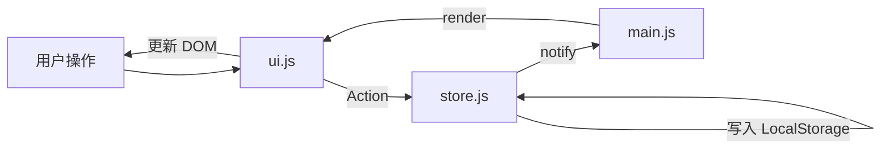

# ☘️ 小日常 PWA

面向 **iOS「小日常」** 使用习惯的 **纯本地** Web 打卡应用：毛玻璃界面、流畅微交互；**无后端、无第三方 API、无外链资源**；习惯与设置仅存 `localStorage`；**联网加载一次后，关服务器、断网仍可完整使用**。

> 本项目为个人自用 PWA，**非** App Store 官方应用。主屏幕图标取自 [小日常](https://apps.apple.com/cn/app/id1263789061) 在商店的展示图，仅供个人设备使用；公开发布或商用前请自行取得授权。

---

## 快速开始

```bash
npm install
npm run dev      # 开发调试：端口 5173（仅改代码时用）
npm run build    # 仅构建，不启动服务
npm run preview  # 需先 build；启动预览服务
npm run start    # 构建 + 启动预览（推荐，手机用这个）
```

| 命令 | 端口 | 用途 |
|------|------|------|
| `npm run dev` | **5173** | 热更新开发，**不要**用来添加主屏幕 |
| `npm run start` / `preview` | **8787** | 手机访问 `http://192.168.x.x:8787` |

须先执行 `npm run start`（或 `build` 后再 `preview`）保持服务运行；仅 `npm run build` 不会启动服务器。

### 纯本地使用（必读）

| 层级 | 说明 |
|------|------|
| 数据 | 习惯、打卡、主题、通知开关 → `localStorage`，读写不经过网络 |
| 备份 | 导出 / 导入 JSON，加解密在浏览器内完成（`@noble/*`），不上传 |
| 静态资源 | 单文件 `index.html`（内联 JS/CSS）+ SW **仅读缓存**；预缓存失败不覆盖旧版本 |
| 字体 | 使用系统字体栈，不加载 Google Fonts 等外链 |

**推荐流程（手机主屏幕离线，含强杀后冷启动）：**

1. 电脑执行 **`npm run start`**，手机打开 **`http://192.168.x.x:8787`**（IP 以终端 Network 为准）。
2. 手机 **联网** 等到打卡列表出现，再从 **8787** 这一地址「添加到主屏幕」（勿用 5173 开发地址）。
3. 可强杀 App、断网、关电脑后再从主屏幕打开；须先在联网时见到打卡页（写入 Cache + IndexedDB 双备份）。

**若断网白屏**：多半是主屏幕仍指向旧地址或未写完缓存。删除主屏幕图标 → 清除站点数据 → 在 **8787 联网** 打开至打卡页 → 再添加主屏幕。应用已改为「不阻塞启动」：即使 SW 未命中也会尝试进入；离线且双备份皆空时会显示提示而非空白。

> 升级版本后：请联网打开一次以更新缓存。若仍白屏，删除主屏幕图标 → 设置里清除该站点数据 → 重新添加。

> `npm run dev` 仅用于改代码，**不能**作为离线方案。

---

## 功能概览

### 打卡（首页）

- **周视图日期条**：横向切换本周日期，可查看与补打历史；今日高亮，当日全部完成时显示完成态。
- **习惯分组**：按晨间 / 午后 / 晚间 / 全天自动归类。
- **习惯配置**：名称、励志寄语、6 种主题色、12 种 **习惯卡片 SVG 图标**、按星期设定的打卡频率。
- **交互**：点击完成圈切换状态；支持触觉反馈（`navigator.vibrate`）；长按卡片或点编辑进入修改。

### 统计

- **今日完成率**：环形进度展示当前选中日期的完成比例。
- **连续打卡**：当前连续、历史最长、累计打卡天数。
- **热力图**：GitHub 风格；支持「全部习惯」或「单个习惯」；可切换 **30 天** / **90 天**。

### 设置与 PWA

| 能力 | 说明 |
|------|------|
| 主题 | 深色 / 浅色 / 跟随系统 |
| 通知 | 申请权限后由 Service Worker 发送提醒（依赖浏览器支持） |
| 安装 | Chromium 捕获 `beforeinstallprompt`；**iOS** 需 Safari → 分享 → **添加到主屏幕** |
| 离线 | 首次联网缓存整站；之后 **仅读本地缓存**（生产构建不发起资源网络请求） |
| 数据 | 导入 / 导出 JSON；可选密码，**全程浏览器内** PBKDF2 + AES-GCM 加密 |

### 数据与隐私

- **存储键**：`localStorage` → `habit_tracker_data`（习惯、打卡记录、主题、通知开关等）。
- **不上传服务器**：打卡与备份加解密均在本地完成；`http://` 局域网亦可加密导出（使用 `@noble/hashes` / `@noble/ciphers`，不依赖 `crypto.subtle`）。
- **备份兼容**：支持未加密旧备份；旧备份中的 `iconTheme` 等已废弃字段会被忽略。
- **首次启动**：内置 3 条示例习惯，便于体验。

### 图标说明（易混淆）

| 类型 | 位置 | 说明 |
|------|------|------|
| **应用图标** | `public/assets/icons/icon-192x192.png`、`icon-512x512.png` | 与 iOS 商店「小日常」一致；**设置内不可切换** |
| **习惯图标** | 新建/编辑习惯时的图标网格 | 12 种内置 SVG（`utils.js` → `HABIT_ICONS`），仅影响卡片展示 |

---

## 技术栈

| 类别 | 选型 |
|------|------|
| 构建 | [Vite 5.x](https://vitejs.dev/) |
| 运行时 | HTML5 + 原生 JavaScript（ES Modules） |
| 样式 | Vanilla CSS + CSS Variables |
| 本地加密 | `local-crypto.js`（PBKDF2-SHA256 10 万次 + AES-256-GCM） |
| PWA | `manifest.json` + `public/sw.js` |

无 React / Vue；`npm run build` 产出纯静态文件，可部署到任意静态托管。

---

## 项目结构

```text
habit-tracker-pwa/
├── index.html              # 应用骨架（打卡 / 统计 / 设置 + 习惯模态框）
├── vite.config.js          # 开发/预览：HTTP + host 局域网
├── package.json
├── public/
│   ├── manifest.json       # PWA 清单（standalone、竖屏）
│   ├── sw.js               # Service Worker（Cache-First 离线）
│   ├── sw-precache.js      # 预缓存 URL 列表（build 时写入 dist）
│   └── assets/icons/       # 应用图标 + badge.png
└── src/
    ├── main.js             # 入口：store / ui / pwa，订阅重绘
    ├── css/
    │   ├── variables.css   # 主题与习惯色变量
    │   ├── style.css       # 布局、字体、安全区域
    │   └── components.css  # 玻璃卡片、热力图、表单等
    └── js/
        ├── store.js        # 状态、LocalStorage、统计与热力图
        ├── ui.js           # 视图与交互
        ├── pwa.js          # SW 注册、安装提示、通知
        ├── offline-shell.js # SW 注册与首次本地缓存就绪
        ├── local-crypto.js  # 备份加解密
        └── utils.js         # 日期工具、习惯 SVG 图标
```

---

## 架构

轻量单向数据流（发布-订阅）：



---

## 本地开发

需要 [Node.js](https://nodejs.org/) 18+。

开发服务器配置见 `vite.config.js`：`https: false`、`host: true`，便于手机通过局域网 IP 访问。

加密备份、打卡、主题切换在 HTTP 下均可正常使用。

---

## 部署

```bash
npm run build
```

将 **`dist/`** 整目录部署到静态站点。生产环境若需 PWA 安装与 Service Worker，**建议使用 HTTPS**；仅本机或内网 HTTP 访问时，核心打卡与加密备份仍可用。

确保站点根路径可访问 `manifest.json` 与 `sw.js`（Vite 会把 `public/` 内容复制到 `dist/` 根目录）。

常见托管：Nginx、GitHub Pages、Cloudflare Pages、Vercel 等。

### 更新主屏幕图标后

浏览器与 iOS 会强缓存旧图标。若更换了 `public/assets/icons/` 中的 PNG：

1. 修改 `public/sw.js` 中的 `CACHE_NAME` 版本号并重新构建；
2. 硬刷新页面或卸载旧 PWA 后重新「添加到主屏幕」。

---

## 浏览器支持

| 能力 | 说明 |
|------|------|
| 核心打卡 | Chrome、Safari、Firefox、Edge 等现代浏览器 |
| PWA 安装 | Chromium 桌面 / Android；iOS 仅「添加到主屏幕」 |
| 推送通知 | 需 `Notification` API + Service Worker |
| 加密备份 | HTTP / HTTPS 均可（纯 JS 本地加解密） |

---

## 许可证与声明

- 代码：个人学习 / 自用，仓库未单独声明协议时以所有者约定为准。
- **「小日常」名称与 App 图标**：版权归原 App 开发者；本仓库不主张相关商标或美术资产权利。
